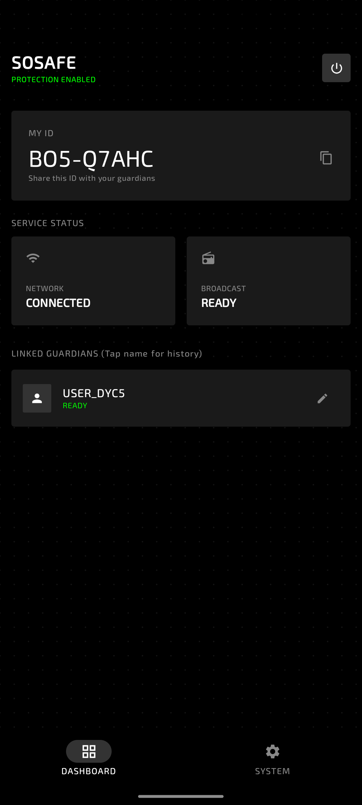
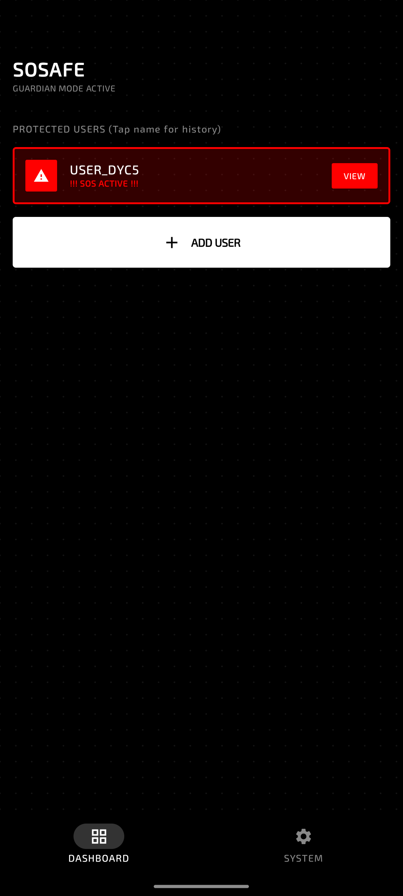
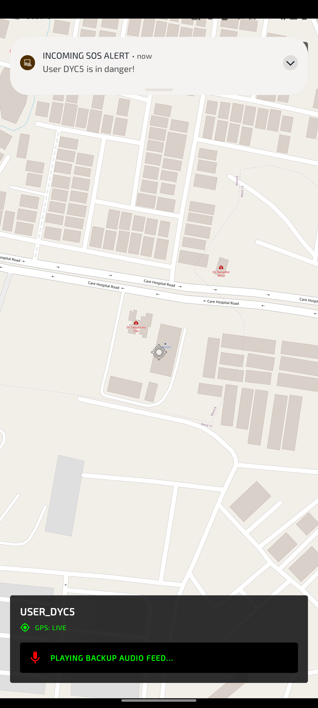
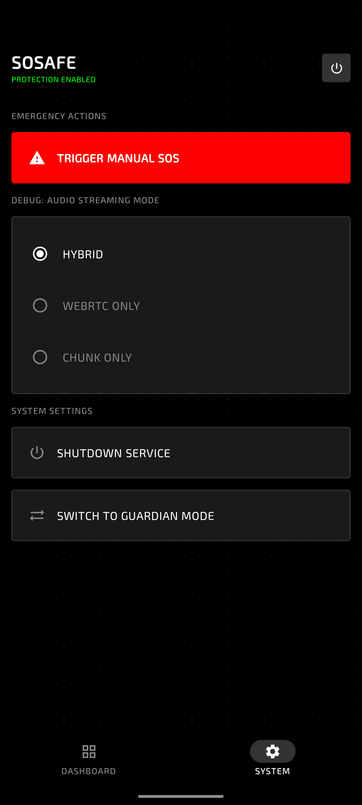
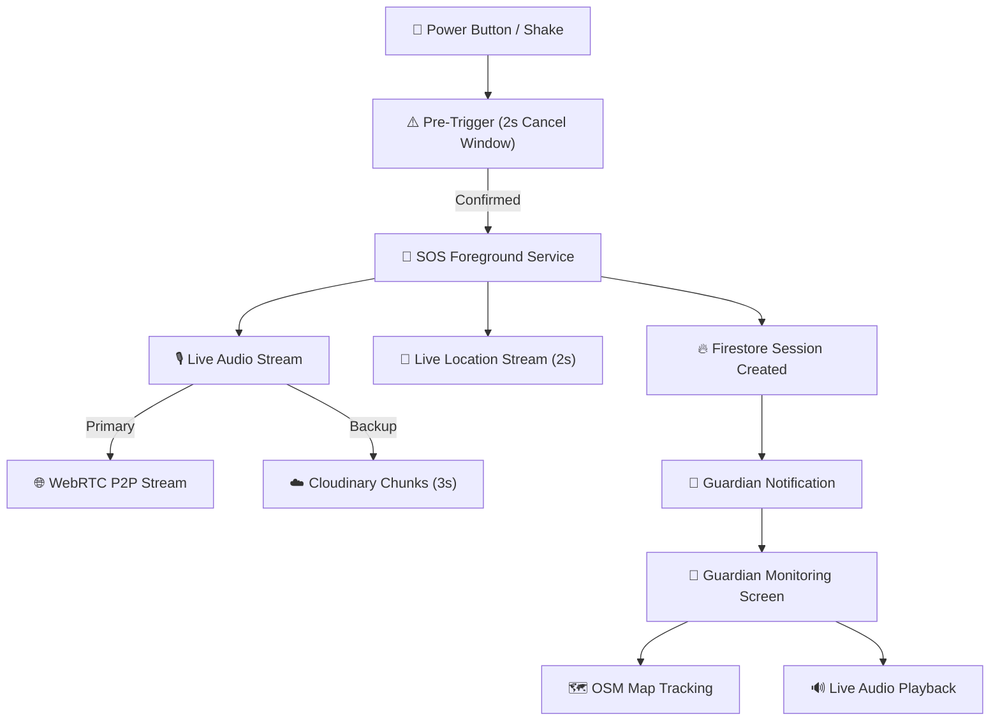

# SoSafe

**SoSafe** is a real-time, event-driven emergency safety application for Android designed to provide rapid, hands-free SOS triggering, live location sharing, and high-fidelity audio transmission to trusted guardians.

Built with a focus on speed and reliability, SoSafe addresses the critical need for immediate communication during emergencies. It leverages a modern streaming architecture and hardware-level triggers to ensure your safety net is always just a gesture away.

---

## 🚀 Key Features

- **Hands-Free Rapid Triggering**: Activate an SOS alert without unlocking your phone via hardware gestures (3 rapid power button presses or a distinct shake).
- **Pre-Trigger Cancel Window**: Provides a 2-second grace period with vibration feedback to cancel false triggers before notifying guardians.
- **Hybrid Real-Time Audio**: Streams live audio via WebRTC for ultra-low latency monitoring, with a parallel sequence-based chunked audio fallback uploaded to Cloudinary.
- **Live Location Streaming**: Continuously pushes precise geographic coordinates to Firebase Firestore every 2 seconds for real-time tracking on the guardian's map.
- **Persistent Foreground Service**: Operates reliably in the background as a high-priority service, surviving aggressive OS battery optimizations.
- **Guardian Dashboard**: Allows trusted contacts to monitor live incidents with real-time audio feeds and interactive map tracking.

---

## 📱 Preview

|  |  |  |  |
| :---: | :---: | :---: | :---: |
| Dashboard | Live Monitoring | Incoming Alert | Details |

---

## ⚙️ How It Works

SoSafe operates on a deterministic, sequence-based streaming model to minimize latency and maximize reliability during an emergency:

1. **Detection**: The background triggers monitor accelerometer data and power button broadcasts.
2. **Activation**: Upon detection (and if not cancelled), the app starts the `SOSForegroundService` and creates an active session in Firestore.
3. **Dual-Channel Streaming**:
   - **Location**: Fetched via `FusedLocationProviderClient` and pushed to the session document.
   - **Audio**: Captured and routed through a hybrid pipeline (WebRTC P2P stream + 3-second AAC chunks uploaded to Cloudinary).
4. **Guardian Reception**: The guardian app listens for active sessions, triggers a loud siren alert, and opens the monitoring screen to display the live map and play the audio feed.

### Architecture Pipeline



---

## 🛠️ Tech Stack

- **Platform**: Android Native (SDK 26+)
- **Language**: Kotlin
- **UI Framework**: Jetpack Compose
- **Backend/Database**: Firebase Firestore, Firebase Cloud Messaging (FCM)
- **Media Storage**: Cloudinary (via OkHttp uploads)
- **Streaming**: WebRTC (Real-time P2P Audio)
- **Maps**: osmdroid (OpenStreetMap)
- **Concurrency**: Kotlin Coroutines & StateFlow

---

## 📂 Project Structure

```text
├── app/
│   ├── src/
│   │   ├── main/
│   │   │   ├── java/com/rohit/sosafe/
│   │   │   │   ├── architecture/   # Session & Audio playback controllers
│   │   │   │   ├── data/           # Schema contracts and state managers
│   │   │   │   ├── service/        # Foreground service and broadcast receivers
│   │   │   │   ├── ui/             # Compose screens, ViewModels, and themes
│   │   │   │   └── utils/          # WebRTC, Cloudinary, and trigger helpers
│   │   │   └── AndroidManifest.xml
│   └── build.gradle.kts
├── build.gradle.kts
└── settings.gradle.kts
```

---

## 🎛️ Key Configuration

The behavior of the SOS engine is controlled by several key parameters:

| Parameter | Default Value | Description |
| :--- | :--- | :--- |
| `CHUNK_DURATION_MS` | `3000ms` | Duration of audio chunks for fallback upload. |
| `POWER_BUTTON_TIMEOUT` | `1500ms` | Time window to register rapid button presses. |
| `LOCATION_UPDATE_INTERVAL` | `2000ms` | Frequency of GPS location updates to Firestore. |
| `CANCEL_WINDOW_MS` | `2000ms` | Grace period to cancel SOS before activation. |

---

## 📦 Installation & Setup

To build and run SoSafe locally, you will need **Android Studio** (Ladybug or newer recommended).

1. **Clone the Repository**:
   ```bash
   git clone https://github.com/RohitKSahoo/SoSafe.git
   ```
2. **Add Firebase**:
   - Create a project in the Firebase Console.
   - Add an Android app with package name `com.rohit.sosafe`.
   - Download `google-services.json` and place it in the `app/` directory.
3. **Configure Cloudinary**:
   - Open `local.properties` in the root directory.
   - Add your Cloudinary credentials (the build script will inject them):
     ```properties
     cloudinary.cloud_name=your_cloud_name
     cloudinary.upload_preset=your_upload_preset
     ```
4. **Build and Run**:
   - Connect a physical Android device (recommended for testing hardware triggers and WebRTC).
   - Click the **Run** icon in Android Studio.

---

## 🔬 Engineering Highlights

- **Hybrid Audio Pipeline**: To combat the unpredictable nature of mobile networks during emergencies, SoSafe implements WebRTC for low-latency live audio, while simultaneously uploading short chunks to Cloudinary to provide a reliable history and fallback.
- **Low-Level Hardware Triggers**: By utilizing low-level broadcast receivers for screen events and accelerometer listeners, the app can detect SOS gestures reliably even when the device is locked or in the user's pocket.
- **Resource Management**: The app strictly separates monitoring logic from UI components via dedicated controllers (`SessionController`, `AudioPlaybackController`), preventing memory leaks and ensuring clean lifecycle management.

---

## 🗺️ Roadmap

- [ ] **End-to-End Encryption**: Encrypt audio chunks and WebRTC streams for maximum privacy.
- [ ] **AI Distress Detection**: Integrate on-device ML to automatically trigger SOS if screaming or distress keywords are detected.
- [ ] **SMS Fallback**: Implement automatic SMS alerts with location links when mobile data is unavailable.

---

## 📄 License

This project is licensed under the MIT License - see the [LICENSE](LICENSE) file for details.
