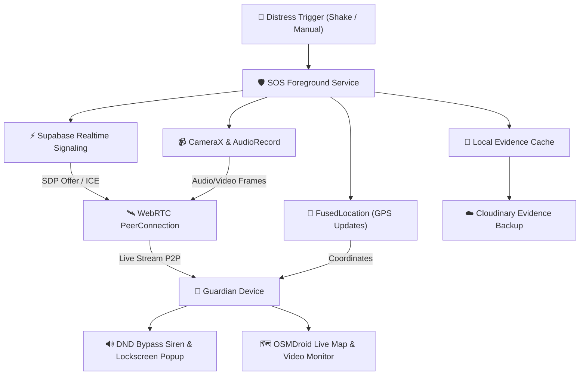

# SoSafe

**SoSafe** is a real-time, peer-to-peer personal distress safety ecosystem engineered for instant emergency detection, low-latency live WebRTC audio/video broadcasting, dynamic network telemetry, and real-time guardian coordination.

Built for Android, SoSafe addresses critical response latency in personal safety situations. It empowers individuals to stream live audio, video, and GPS coordinates directly to trusted emergency contacts, overriding silent/DND modes on guardian devices and capturing multi-sensor evidence in the background without relying on centralized proprietary infrastructure.

---

## 🚀 Key Features

- **Real-Time WebRTC Media Streaming**: Zero-latency peer-to-peer live audio and camera video broadcasting with dynamic bitrate adaptation and Supabase realtime signaling.
- **Dual Operating Modes (Sender & Guardian)**: Dedicated architectural pipelines for active distress broadcast (Sender) and passive monitoring / evidence review (Guardian).
- **Background Sensor & Hardware SOS Triggers**: Ultra-responsive background gesture detection (accelerometer shake threshold) and one-tap manual emergency triggers.
- **Emergency Siren & DND Bypass**: High-priority alert popups with full-volume alarm sirens and lockscreen wake locks that override Do Not Disturb mode on guardian devices.
- **Instant 2-Step Pairing & Deep Linking**: Instant pairing via QR code (CameraX + ML Kit / ZXing) and secure HTTPS deep links (`https://rohitksahoo.github.io/SoSafe/pair`) with 10-minute expiry safety gates.
- **Live Geospatial Tracking**: Continuous real-time GPS coordinate synchronization rendered on an interactive map view (OSMDroid).
- **Evidence Storage & History Archival**: Automatic local session recording with Cloudinary integration for cloud backup and instant past-session replay.

---

## 📱 Preview

|  |  |  |  |
| :---: | :---: | :---: | :---: |
| Dashboard | Sender SOS | Live Monitor | System Settings |

---

## ⚙️ How It Works

SoSafe operates on a distributed, multi-stage pipeline designed for resilience even under weak network conditions:

1. **Distress Detection**: Accelerometer-driven shake analysis or manual trigger initiates `ACTION_START_EMERGENCY`.
2. **Signaling & P2P Handshake**: The sender generates a WebRTC SDP offer and broadcasts it over Supabase Realtime channels with an adaptive 500ms polling fallback.
3. **Live Media & Telemetry Streaming**: WebRTC peer connection is established for live bidirectional audio and sender video feed while `FusedLocationProviderClient` streams continuous GPS updates.
4. **Guardian Dispatch & Evidence Storage**: The guardian device triggers full-volume audio sirens, renders the live map and media stream, and persists the recording for post-incident review.

### Architecture Pipeline


```mermaid
graph TD
    A["🚨 Distress Trigger (Shake / Manual)"] --> B["🛡️ SOS Foreground Service"]
    B --> C["📍 FusedLocation (GPS Updates)"]
    B --> D["📹 CameraX & AudioRecord"]
    B --> E["⚡ Supabase Realtime Signaling"]
    
    E -->|SDP Offer / ICE| F["🛰️ WebRTC PeerConnection"]
    D -->|Audio/Video Frames| F
    
    F -->|Live Stream P2P| G["📱 Guardian Device"]
    C -->|Coordinates| G
    
    G --> H["🔊 DND Bypass Siren & Lockscreen Popup"]
    G --> I["🗺️ OSMDroid Live Map & Video Monitor"]
    
    B --> J["💾 Local Evidence Cache"]
    J --> K["☁️ Cloudinary Evidence Backup"]
```

---

## 🛠️ Tech Stack

- **Platform**: Android Native (minSdk 26, targetSdk 36)
- **Language**: Kotlin
- **UI Framework**: Jetpack Compose (Material 3 + Industrial Dark Aesthetic)
- **Real-Time & Streaming**: WebRTC (`io.github.webrtc-sdk`), Supabase Realtime (PostgreSQL Channels)
- **Background & Sensors**: Android Foreground Service, `SensorManager` (Accelerometer), `FusedLocationProviderClient`
- **Vision & Scanning**: CameraX, Google ML Kit Barcode Scanning, ZXing Core
- **Maps & Geolocation**: OSMDroid (OpenStreetMap)
- **Cloud & Storage**: Cloudinary REST API, Local Internal Storage
- **Concurrency**: Kotlin Coroutines & StateFlow

---

## 📂 Project Structure

```text
├── app/
│   ├── src/
│   │   ├── main/
│   │   │   ├── java/com/rohit/sosafe/
│   │   │   │   ├── architecture/     # Audio & Video streaming controllers
│   │   │   │   ├── data/             # State models, managers, and Supabase contracts
│   │   │   │   ├── service/          # Persistent SOS Foreground Service & trigger listeners
│   │   │   │   ├── ui/               # Jetpack Compose dashboards, screens, and components
│   │   │   │   ├── utils/            # QR utilities, Cloudinary uploader, and recording manager
│   │   │   │   └── MainActivity.kt   # Navigation host and permission controller
│   │   │   ├── res/                  # Drawables, layout, themes, and notification assets
│   │   │   └── AndroidManifest.xml
│   └── build.gradle.kts
├── assets/                           # Screenshots and visual branding assets
├── study_docs/                       # Comprehensive phase-by-phase architecture documentation
├── build.gradle.kts
└── settings.gradle.kts
```

---

## 🎛️ Key Configuration

The detection and streaming engine parameters are configurable via application properties and runtime managers:

| Parameter | Default Value | Description |
| :--- | :--- | :--- |
| `SHAKE_THRESHOLD` | `14.0 m/s²` | Accelerometer acceleration threshold to trigger emergency. |
| `SHAKE_SLOP_TIME_MS` | `500 ms` | Minimum delay between shake detections to avoid accidental triggers. |
| `PAIRING_TIMEOUT_SEC` | `600 s (10m)`| Validity period for pairing requests before expiring. |
| `SIGNALING_POLL_INTERVAL` | `500 ms` | Fallback polling interval for WebRTC SDP & ICE exchange. |
| `AUDIO_BITRATE_DYNAMIC` | `16 - 64 kbps` | Adaptive Opus audio bitrate adjusted based on network condition. |
| `LOCATION_UPDATE_INTERVAL`| `3000 ms` | Interval for GPS coordinate sampling during active distress. |

---

## 📦 Installation & Setup

To build and run SoSafe locally, you will need **Android Studio** (Ladybug or newer recommended).

1. **Clone the Repository**:
   ```bash
   git clone https://github.com/RohitKSahoo/SoSafe.git
   cd SoSafe
   ```

2. **Configure Local Secrets**:
   Create a `local.properties` file in the root directory and add your Supabase and Cloudinary credentials:
   ```properties
   supabase.url=https://YOUR_SUPABASE_PROJECT.supabase.co
   supabase.key=YOUR_SUPABASE_ANON_KEY
   cloudinary.cloud_name=YOUR_CLOUDINARY_NAME
   cloudinary.upload_preset=YOUR_UPLOAD_PRESET
   ```

3. **Open and Build**:
   - Open the project directory in Android Studio.
   - Sync Gradle dependencies.
   - Build and install on two physical Android devices to test peer-to-peer pairing and live WebRTC transmission:
   ```bash
   ./gradlew assembleDebug
   ```

---

## 🔬 Engineering Highlights

- **Zero-Latency P2P Video/Audio Transmission**: Direct WebRTC peer connections bypass server relay bottlenecks, streaming raw video and Opus audio in real-time.
- **Resilient Lockscreen & DND Bypass**: Uses Android `NotificationManager` policy access and `SYSTEM_ALERT_WINDOW` permissions to ensure emergency alarms ring at full volume even when the guardian's phone is silenced or locked.
- **Battery-Aware Background State Machine**: Accelerometer and sensor listeners are active only in **Sender Mode**, while **Guardian Mode** transitions to passive socket listening to minimize background battery drain.
- **Dual Signaling Architecture**: Combines Supabase PostgreSQL realtime replication with high-frequency HTTP polling fallbacks to ensure instant SDP negotiation across cellular NATs.

---

## 🗺️ Roadmap

- [ ] **WearOS Quick-Trigger Companion**: Trigger discreet SOS broadcasts directly from a smartwatch gesture or complication.
- [ ] **Offline Mesh Relaying**: Route distress packets via nearby BLE (Bluetooth Low Energy) mesh nodes when internet connectivity is unavailable.
- [ ] **AI-Powered Distress Keyword VAD**: On-device voice activity detection and keyword spotter (e.g., "Help", "Emergency") to trigger hands-free SOS.

---

## 📄 License

This project is licensed under the MIT License - see the [LICENSE](LICENSE) file for details.
