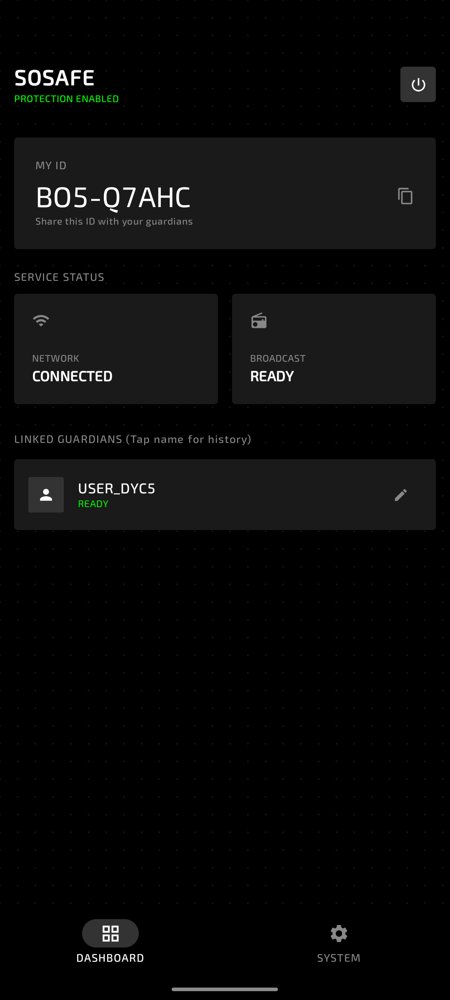
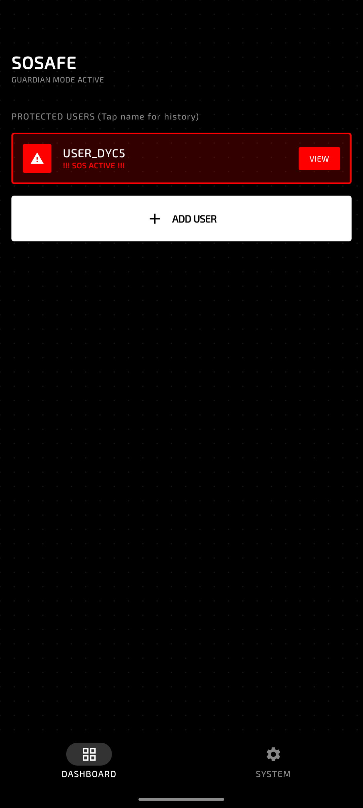
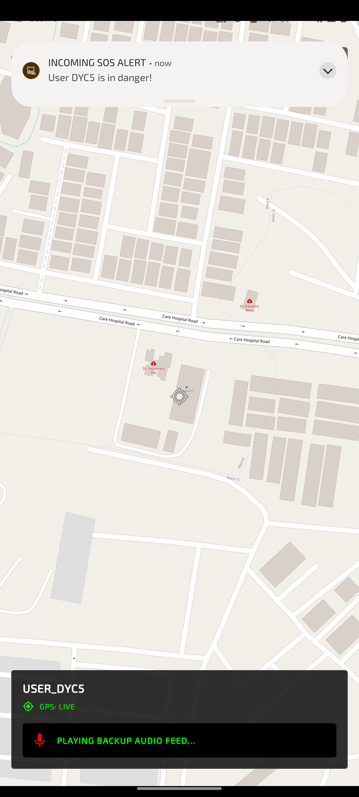
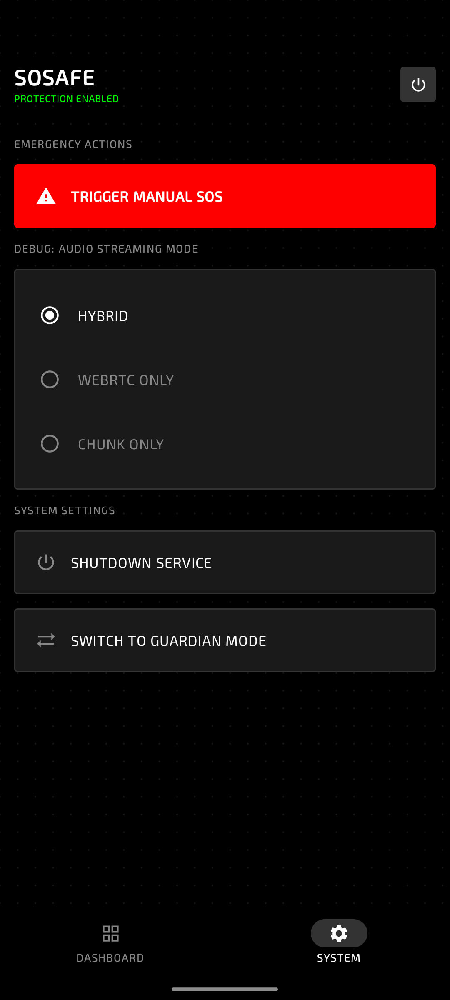
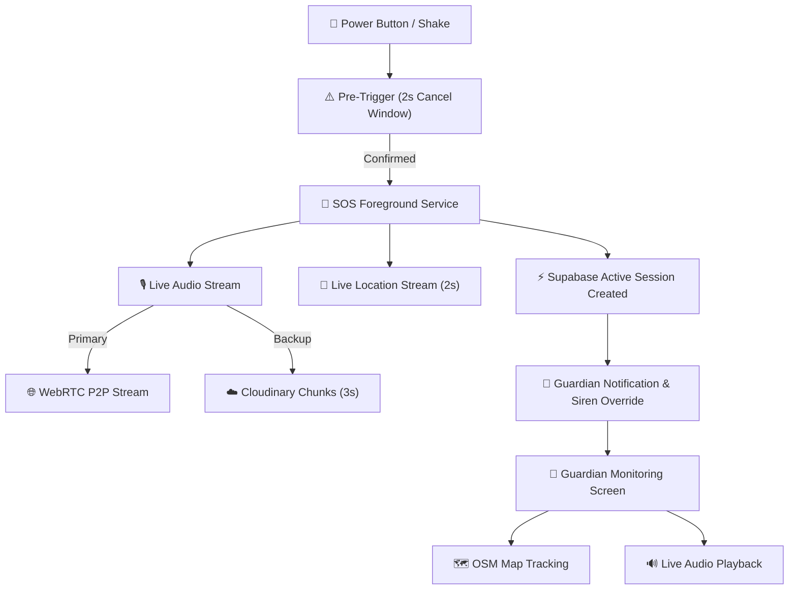

# SoSafe

**SoSafe** is a real-time, event-driven emergency safety application for Android designed to provide rapid, hands-free SOS triggering, live location sharing, and high-fidelity audio transmission to trusted guardians.

Built with a focus on speed and reliability, SoSafe addresses the critical need for immediate communication during emergencies. It leverages a modern streaming architecture, hardware-level triggers, and emergency audio override mechanisms to ensure your safety net is always active.

---

## 🚀 Key Features

- **Hands-Free Rapid Triggering**: Activate an SOS alert without unlocking your phone via hardware gestures (3 rapid power button presses or a distinct shake).
- **Pre-Trigger Cancel Window**: Provides a 2-second grace period with vibration feedback to cancel false triggers before notifying guardians.
- **2-Step Guardian Pairing & Contact Sync**: Secure symmetric contact pairing between Senders and Guardians with custom renaming, pairing approvals, and persistent cloud sync.
- **Silent & DND Emergency Siren Override**: Emergency alert calls bypass phone Silent, Vibrate, and Do Not Disturb (DND) modes out loud using native `USAGE_ALARM` audio routing and continuous siren loops.
- **Hybrid Real-Time Audio**: Streams live audio via WebRTC for ultra-low latency monitoring, with a parallel sequence-based chunked audio fallback uploaded to Cloudinary.
- **Dynamic Network & Signal Quality Monitor**: Displays live network connectivity state (Connected/Disconnected), transport type (`WIFI` vs `MOBILE DATA`), and color-coded signal quality ratings for WebRTC voice readiness.
- **Live Location Streaming**: Continuously pushes precise geographic coordinates for real-time tracking on the guardian's map.
- **Persistent Foreground Service**: Operates reliably in the background as a high-priority service, surviving aggressive OS battery optimizations.
- **Guardian Dashboard**: Allows trusted contacts to monitor live incidents with real-time audio feeds, interactive map tracking, and past recording playback history.

---

## 📱 Preview

|  |  |  |  |
| :---: | :---: | :---: | :---: |
| Dashboard | Live Monitoring | Incoming Alert | Details |

---

## ⚙️ How It Works

SoSafe operates on a deterministic, sequence-based streaming model to minimize latency and maximize reliability during an emergency:

1. **Detection**: The background triggers monitor accelerometer data and power button broadcasts.
2. **Activation**: Upon detection (and if not cancelled), the app starts the `SOSForegroundService` and creates an active session in Supabase & Firestore.
3. **Dual-Channel Streaming**:
   - **Location**: Fetched via `FusedLocationProviderClient` and pushed to the active session document.
   - **Audio**: Captured and routed through a hybrid pipeline (WebRTC P2P stream + 3-second AAC chunks uploaded to Cloudinary).
4. **Guardian Reception**: The guardian app listens for active sessions, triggers a loud siren alert (bypassing Silent/DND modes), and opens the monitoring screen to display the live map and play the audio feed.

### Architecture Pipeline


```mermaid
graph TD
    A["🔋 Power Button / Shake"] --> B["⚠️ Pre-Trigger (2s Cancel Window)"]
    B -->|Confirmed| C["🚀 SOS Foreground Service"]
    C --> D["⚡ Supabase Active Session Created"]
    C --> E["📡 Live Location Stream (2s)"]
    C --> F["🎙️ Live Audio Stream"]
    F -->|Primary| G["🌐 WebRTC P2P Stream"]
    F -->|Backup| H["☁️ Cloudinary Chunks (3s)"]
    D --> I["🔔 Guardian Notification & Siren Override"]
    I --> J["📱 Guardian Monitoring Screen"]
    J --> K["🗺️ OSM Map Tracking"]
    J --> L["🔊 Live Audio Playback"]
```

---

## 🛠️ Tech Stack

- **Platform**: Android Native (SDK 26+)
- **Language**: Kotlin
- **UI Framework**: Jetpack Compose
- **Backend & Database**: Supabase (PostgreSQL / Realtime REST API), Firebase Firestore, Firebase Cloud Messaging (FCM)
- **Media Storage**: Cloudinary (via OkHttp uploads)
- **Streaming**: WebRTC (Real-time P2P Audio)
- **Maps**: osmdroid (OpenStreetMap)
- **Concurrency**: Kotlin Coroutines & StateFlow

---

## 📂 Project Structure

```text
├── app/
│   ├── src/
│   │   ├── main/
│   │   │   ├── java/com/rohit/sosafe/
│   │   │   │   ├── architecture/   # Session & Audio playback controllers
│   │   │   │   ├── data/           # Schema contracts, UserManager, and Supabase REST/Realtime API
│   │   │   │   ├── service/        # Foreground service, messaging, and receivers
│   │   │   │   ├── ui/             # Compose screens, ViewModels, and themes
│   │   │   │   └── utils/          # WebRTC, NetworkMonitor, and trigger helpers
│   │   │   └── AndroidManifest.xml
│   └── build.gradle.kts
├── .agents/                        # Agent skills and custom workspace rules
├── study_docs/                     # Phase-wise architectural documentation & checkpoints
├── build.gradle.kts
└── settings.gradle.kts
```

---

## 🎛️ Key Configuration

The behavior of the SOS engine is controlled by several key parameters:

| Parameter | Default Value | Description |
| :--- | :--- | :--- |
| `CHUNK_DURATION_MS` | `3000ms` | Duration of audio chunks for fallback upload. |
| `POWER_BUTTON_TIMEOUT` | `1500ms` | Time window to register rapid button presses. |
| `LOCATION_UPDATE_INTERVAL` | `2000ms` | Frequency of GPS location updates to Supabase/Firestore. |
| `CANCEL_WINDOW_MS` | `2000ms` | Grace period to cancel SOS before activation. |

---

## 📦 Installation & Setup

To build and run SoSafe locally, you will need **Android Studio** (Ladybug or newer recommended).

1. **Clone the Repository**:
   ```bash
   git clone https://github.com/RohitKSahoo/SoSafe.git
   ```
2. **Add Firebase**:
   - Create a project in the Firebase Console.
   - Add an Android app with package name `com.rohit.sosafe`.
   - Download `google-services.json` and place it in the `app/` directory.
3. **Configure Environment Credentials**:
   - Open `local.properties` in the root directory.
   - Add your Cloudinary and Supabase credentials:
     ```properties
     cloudinary.cloud_name=your_cloud_name
     cloudinary.upload_preset=your_upload_preset
     supabase.url=https://your-supabase-url.supabase.co
     supabase.anon_key=your_supabase_anon_key
     ```
4. **Build and Run**:
   - Connect a physical Android device (recommended for testing hardware triggers, sound override, and WebRTC).
   - Click the **Run** icon in Android Studio or execute:
     ```bash
     ./gradlew assembleDebug
     ```

---

## 📚 Architectural Study Docs & Phase Tracking

Phase-wise development progress, architecture details, and verification checkpoints are systematically documented in the [`study_docs/`](file:///d:/Projects/SoSafe/study_docs/) directory:

- **[Master Phase Index](file:///d:/Projects/SoSafe/study_docs/README.md)**
- **[Phase 1: WebRTC Live Audio Signaling & Fallback](file:///d:/Projects/SoSafe/study_docs/phase-1.md)** (`🟢 Completed`)
- **[Phase 2: SOS Triggering & Foreground Service](file:///d:/Projects/SoSafe/study_docs/phase-2.md)** (`🟢 Completed`)
- **[Phase 3: 2-Step Guardian Pairing & Contact Sync Fix](file:///d:/Projects/SoSafe/study_docs/phase-3.md)** (`🟢 Completed`)
- **[Phase 4: Emergency Siren Override & Lockscreen Alert](file:///d:/Projects/SoSafe/study_docs/phase-4.md)** (`🟢 Completed`)
- **[Phase 5: Dynamic Network Monitor & Signal Quality UI](file:///d:/Projects/SoSafe/study_docs/phase-5.md)** (`🟢 Completed`)

---

## 🔬 Engineering Highlights

- **Hybrid Audio Pipeline**: To combat the unpredictable nature of mobile networks during emergencies, SoSafe implements WebRTC for low-latency live audio, while simultaneously uploading short chunks to Cloudinary to provide a reliable history and fallback.
- **Hardware Alarm Channel Siren Override**: Emergency alert calls route audio through Android's native `STREAM_ALARM` hardware channel, overriding Silent and Do Not Disturb profiles out loud without requiring intrusive system permissions.
- **Resource Management**: The app strictly separates monitoring logic from UI components via dedicated controllers (`SessionController`, `AudioPlaybackController`, `NetworkMonitor`), preventing memory leaks and ensuring clean lifecycle management.

---

## 📄 License

This project is licensed under the MIT License - see the [LICENSE](LICENSE) file for details.

