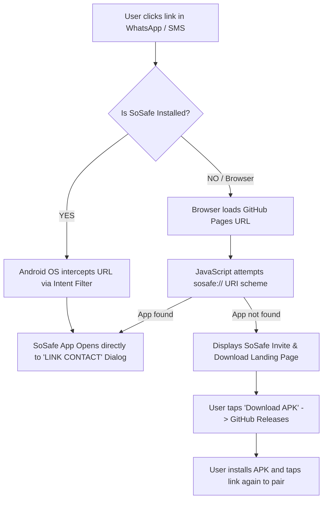

# SoSafe Universal Deep Link & Fallback Landing Page Setup Guide

This guide outlines how to configure a **100% free** landing page on GitHub Pages that serves two distinct user experiences:
1. **Installed Users**: Automatically opens the SoSafe app directly to the pairing confirmation dialog.
2. **Non-Installed Users**: Displays an invite card showing the inviter's name/ID with a direct button to download the latest APK from GitHub Releases.

---

## 🏗️ Architecture Overview



---

## 🚀 Setup Steps (5 Minutes)

### Step 1: Enable GitHub Pages in your Repository
1. Go to your GitHub repository: `https://github.com/RohitKSahoo/SoSafe`.
2. Click **Settings** ➔ **Pages** (in the left sidebar).
3. Under **Build and deployment**:
   - **Source**: Select `Deploy from a branch`.
   - **Branch**: Select `main` (or create a `gh-pages` branch), folder: `/docs` (or `/root`).
   - Click **Save**.
4. GitHub Pages will be live at: `https://rohitksahoo.github.io/SoSafe/`.

---

### Step 2: Create the `pair/index.html` File

Create a folder named `docs/pair` (or `pair/` depending on your Pages root) and add this file: `docs/pair/index.html`:

```html
<!DOCTYPE html>
<html lang="en">
<head>
    <meta charset="UTF-8">
    <meta name="viewport" content="width=device-width, initial-scale=1.0">
    <title>SoSafe - Connect & Protect</title>
    <style>
        * {
            box-sizing: border-box;
            margin: 0;
            padding: 0;
            font-family: -apple-system, BlinkMacSystemFont, "Segoe UI", Roboto, sans-serif;
        }
        body {
            background-color: #0A0A0A;
            color: #FFFFFF;
            display: flex;
            justify-content: center;
            align-items: center;
            min-height: 100vh;
            padding: 20px;
        }
        .card {
            background: #141414;
            border: 1px solid #282828;
            border-radius: 12px;
            padding: 32px 24px;
            max-width: 420px;
            width: 100%;
            text-align: center;
            box-shadow: 0 10px 30px rgba(0,0,0,0.5);
        }
        .logo {
            font-size: 28px;
            font-weight: 900;
            letter-spacing: 2px;
            color: #FFFFFF;
            margin-bottom: 24px;
        }
        .logo span {
            color: #E53935;
        }
        .badge {
            display: inline-block;
            background: #1F2937;
            color: #10B981;
            font-weight: bold;
            font-size: 12px;
            padding: 4px 12px;
            border-radius: 9999px;
            margin-bottom: 16px;
        }
        h1 {
            font-size: 20px;
            font-weight: 700;
            margin-bottom: 12px;
        }
        p {
            color: #9CA3AF;
            font-size: 14px;
            line-height: 1.6;
            margin-bottom: 24px;
        }
        .btn {
            display: block;
            width: 100%;
            padding: 14px;
            border-radius: 6px;
            font-size: 15px;
            font-weight: 700;
            text-decoration: none;
            cursor: pointer;
            margin-bottom: 12px;
            transition: transform 0.1s, opacity 0.2s;
        }
        .btn:active {
            transform: scale(0.98);
        }
        .btn-primary {
            background: #FFFFFF;
            color: #000000;
        }
        .btn-secondary {
            background: #1F2937;
            color: #FFFFFF;
            border: 1px solid #374151;
        }
        .steps {
            background: #181818;
            border-radius: 8px;
            padding: 16px;
            text-align: left;
            margin-top: 20px;
            font-size: 13px;
            color: #D1D5DB;
        }
        .steps ol {
            padding-left: 18px;
        }
        .steps li {
            margin-bottom: 8px;
        }
    </style>
</head>
<body>

<div class="card">
    <div class="logo">SO<span>SAFE</span></div>
    
    <div class="badge">SAFETY INVITE</div>

    <h1 id="inviterHeader">Emergency Contact Invite</h1>
    <p id="inviterBody">You have been invited to link as an emergency guardian on SoSafe.</p>

    <!-- Primary Action for Installed Users -->
    <a id="openAppBtn" class="btn btn-primary" href="#">OPEN IN SOSAFE APP</a>

    <!-- Primary Action for New Users -->
    <a id="downloadApkBtn" class="btn btn-secondary" href="https://github.com/RohitKSahoo/SoSafe/releases/latest" target="_blank">
        DOWNLOAD LATEST APK
    </a>

    <div class="steps">
        <strong>First time on SoSafe?</strong>
        <ol>
            <li>Tap <b>Download Latest APK</b> above.</li>
            <li>Install and open the app once to initialize.</li>
            <li>Return here and tap <b>Open in SoSafe App</b> (or re-tap the invite link) to complete linking.</li>
        </ol>
    </div>
</div>

<script>
    // Extract query parameters
    const params = new URLSearchParams(window.location.search);
    const id = params.get('id') || '';
    const name = params.get('name') || 'Someone';

    const safeSchemeUrl = `sosafe://pair?id=${encodeURIComponent(id)}&name=${encodeURIComponent(name)}`;
    const releaseUrl = 'https://github.com/RohitKSahoo/SoSafe/releases/latest';

    // Update UI elements
    if (id) {
        document.getElementById('inviterHeader').innerText = `Connect with ${name}`;
        document.getElementById('inviterBody').innerText = `${name} (${id}) wants to link with you on SoSafe for real-time emergency safety & audio streaming.`;
    }

    const openBtn = document.getElementById('openAppBtn');
    openBtn.href = safeSchemeUrl;

    // Automatic trigger: Try opening the app via custom scheme
    window.location.href = safeSchemeUrl;
</script>

</body>
</html>
```

---

## 🔍 How Each User Scenario Behaves

| User Scenario | What Happens |
|---|---|
| **User has SoSafe installed & clicks WhatsApp/SMS link** | Android OS intercepts the URL directly via `<intent-filter>`. SoSafe launches instantly to the `"LINK CONTACT"` dialog without opening the browser. |
| **User opens link in Chrome / Browser** | GitHub Pages loads `pair/index.html`. The page automatically triggers `sosafe://pair?id=...&name=...` to launch the app. |
| **User does NOT have SoSafe installed** | The custom scheme fails silently. The user sees the clean dark-mode card with inviter details and taps **`DOWNLOAD LATEST APK`** to download from GitHub Releases. |
| **User installs APK and returns to the link** | Tapping **`OPEN IN SOSAFE APP`** or re-clicking the chat link launches their newly installed app and finishes pairing in 1 tap. |

---

## 🛠️ GitHub Releases Maintenance
Whenever you create a new release on GitHub:
1. In your GitHub repo, go to **Releases** ➔ **Draft a new release**.
2. Upload the `app-release.apk`.
3. Publish the release.
4. The link `https://github.com/RohitKSahoo/SoSafe/releases/latest` will automatically download your newest APK for any new user!
